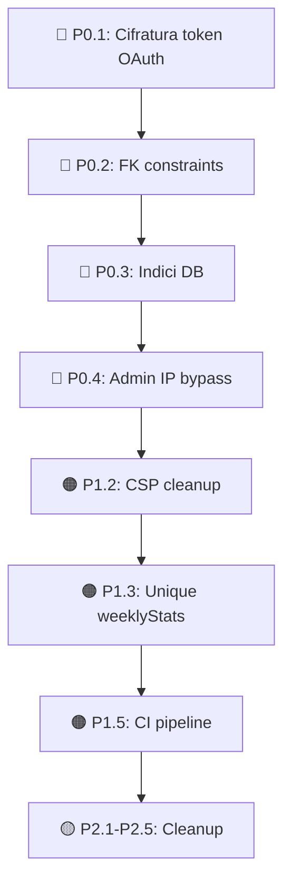

# SwimForge — Analisi Approfondita del Codebase

**Data:** 14 Febbraio 2026  
**Branch:** `swimforge-4.3` @ commit `e7f12b2`  
**Scope:** Sicurezza, integrità DB, architettura, test, DX

---

## Riepilogo Esecutivo

| Severità | Trovati | Categorie principali |
|----------|---------|---------------------|
| 🔴 **P0 — Critico** | 4 | Sicurezza, integrità dati |
| 🟠 **P1 — Importante** | 5 | Sicurezza, architettura, performance |
| 🟡 **P2 — Miglioramento** | 5 | DX, manutenibilità, pulizia codice |

---

## 🔴 P0 — Critici (da risolvere prima del deploy in produzione)

### P0.1 — Token OAuth salvati in chiaro nel DB

| | |
|---|---|
| **File** | [schema.ts](file:///home/scima/projects/swimforge-oppidum-cloud/drizzle/schema.ts#L500-L527) |
| **Tabelle** | `garmin_tokens`, `strava_tokens` |
| **Problema** | `oauth1_token`, `oauth2_token`, `access_token`, `refresh_token` sono colonne `text` senza cifratura |
| **Rischio** | Se il DB viene compromesso (SQL injection, backup leak, accesso non autorizzato), tutti i token di terze parti sono esposti in chiaro |

> [!CAUTION]
> I token OAuth danno accesso pieno ai dati Garmin/Strava degli utenti. In caso di breach, un attaccante potrebbe leggere, modificare o cancellare dati su queste piattaforme per tutti gli utenti.

**Fix consigliato:** Cifrare i token a livello applicativo con `aes-256-gcm` prima di salvarli. Usare una env var `ENCRYPTION_KEY` dedicata (diversa da `JWT_SECRET`). Creare helper `encrypt()`/`decrypt()` in `server/lib/crypto.ts`.

---

### P0.2 — 30+ colonne senza Foreign Key constraints

| | |
|---|---|
| **File** | [schema.ts](file:///home/scima/projects/swimforge-oppidum-cloud/drizzle/schema.ts) e [schema_challenges.ts](file:///home/scima/projects/swimforge-oppidum-cloud/drizzle/schema_challenges.ts) |
| **Problema** | Solo 3 FK definite (tutte su `garmin_activity_laps` e `garmin_activity_lengths`). Tutte le altre `userId`, `postId`, `clubId`, `challengeId`, `activityId` sono integer senza `.references()` |

**Colonne senza FK (lista parziale):**

| Tabella | Colonna | Dovrebbe puntare a |
|---------|---------|-------------------|
| `swimmer_profiles` | `userId` | `users.id` |
| `swimming_activities` | `userId` | `users.id` |
| `user_badges` | `userId`, `badgeId` | `users.id`, `badge_definitions.id` |
| `social_posts` | `userId`, `activityId`, `clubId` | `users.id`, `swimming_activities.id`, `community_clubs.id` |
| `social_splashes` | `postId`, `userId` | `social_posts.id`, `users.id` |
| `social_comments` | `postId`, `userId` | `social_posts.id`, `users.id` |
| `social_follows` | `followerId`, `followingId` | `users.id`, `users.id` |
| `community_club_members` | `clubId`, `userId` | `community_clubs.id`, `users.id` |
| `club_events` | `clubId`, `creatorId` | `community_clubs.id`, `users.id` |
| `event_attendees` | `eventId`, `userId` | `club_events.id`, `users.id` |
| `direct_messages` | `senderId`, `receiverId` | `users.id`, `users.id` |
| `user_notifications` | `userId` | `users.id` |
| `challenges` | `creatorId` | `users.id` |
| `challenge_participants` | `challengeId`, `userId` | `challenges.id`, `users.id` |
| `challenge_activity_log` | `challengeId`, `userId`, `activityId` | `challenges.id`, `users.id`, `swimming_activities.id` |
| `xp_transactions` | `userId` | `users.id` |
| `personal_records` | `userId`, `activityId` | `users.id`, `swimming_activities.id` |

> [!IMPORTANT]
> Senza FK il DB permette righe orfane. Un utente può essere cancellato lasciando badge, post, messaggi fantasma che causano errori 500 o dati inconsistenti.

**Fix:** Creare una migration Drizzle che aggiunge tutte le FK con `ON DELETE CASCADE` o `ON DELETE SET NULL` a seconda del caso.

---

### P0.3 — Indici mancanti su colonne di lookup frequente

| | |
|---|---|
| **Problema** | Le query più frequenti (feed sociale, leaderboard, notifiche, badge utente) eseguono full table scan perché mancano indici su colonne chiave |

**Indici necessari:**

| Tabella | Colonna/e | Tipo query |
|---------|-----------|-----------|
| `swimming_activities` | `userId`, `activityDate` | Lista attività utente |
| `swimming_activities` | `garminActivityId` | Lookup dedup Garmin |
| `swimming_activities` | `stravaActivityId` | Lookup dedup Strava |
| `social_posts` | `userId`, `createdAt` | Feed sociale |
| `social_posts` | `clubId`, `createdAt` | Feed club |
| `social_comments` | `postId` | Commenti sotto un post |
| `user_badges` | `userId` | Badge di un utente |
| `user_notifications` | `userId`, `isRead` | Notifiche non lette |
| `direct_messages` | `senderId`, `receiverId`, `createdAt` | Conversazioni |
| `xp_transactions` | `userId`, `createdAt` | Storico XP |
| `weekly_stats` | `userId`, `weekStart` | Statistiche settimanali |
| `challenge_participants` | `challengeId` | Partecipanti sfida |

**Fix:** Migration Drizzle con `CREATE INDEX CONCURRENTLY` per ogni indice elencato.

---

### P0.4 — Admin IP rate-limit bypass insicuro

| | |
|---|---|
| **File** | [security.ts:36](file:///home/scima/projects/swimforge-oppidum-cloud/server/middleware/security.ts#L35-L37) |
| **Problema** | `req.ip === process.env.ADMIN_IP` — confronto stringa semplice, spoofabile con header `X-Forwarded-For` |

```typescript
skip: (req: Request) => {
  return req.ip === process.env.ADMIN_IP; // ⚠️ spoofable
},
```

> [!WARNING]
> Dietro un proxy (Render), `req.ip` dipende da `trust proxy`. Con `trust proxy: 1` è abbastanza sicuro, ma un attaccante che manipola header all'edge proxy potrebbe bypassare il rate limiting. Inoltre il bypass è solo su `loginLimiter`, non su `apiLimiter` — inconsistente.

**Fix consigliato:** Rimuovere completamente il bypass admin dal rate limiter, oppure usare un header di autenticazione dedicato (`X-Admin-Key`) confrontato con `timingSafeEqual`.

---

## 🟠 P1 — Importanti

### P1.1 — Body parser duplicato / conflitto payload size

| | |
|---|---|
| **File** | [index.ts:86-87](file:///home/scima/projects/swimforge-oppidum-cloud/server/_core/index.ts#L86-L87) vs [security.ts:243-259](file:///home/scima/projects/swimforge-oppidum-cloud/server/middleware/security.ts#L243-L259) |
| **Problema** | `express.json({ limit: "50mb" })` in `index.ts` (per upload foto), ma `payloadSizeLimit` middleware controlla `content-length > 1MB`. Tuttavia `payloadSizeLimit` non è applicato in `applySecurityMiddleware()` quindi attualmente non c'è conflitto — ma il codice è confuso e pronto a creare bug se qualcuno lo aggiunge. |

**Fix:** Decidere un limite unico. Se serve 50MB per upload, applicare `payloadSizeLimit` solo a rotte non-upload, oppure rimuoverlo.

---

### P1.2 — CSP con URL Supabase hardcoded come fallback

| | |
|---|---|
| **File** | [security.ts:188](file:///home/scima/projects/swimforge-oppidum-cloud/server/middleware/security.ts#L188) |
| **Problema** | `'https://wpnxaadvyxmhlcgdobla.supabase.co'` è hardcoded come fallback nel CSP `connectSrc` |

```typescript
connectSrc: [
  "'self'",
  // ...
  process.env.SUPABASE_URL || process.env.NEXT_PUBLIC_SUPABASE_URL || 'https://wpnxaadvyxmhlcgdobla.supabase.co',
  'https://*.supabase.co', // ← questo wildcard rende il fallback hardcoded ridondante
],
```

**Fix:** Rimuovere l'URL hardcoded — il wildcard `*.supabase.co` copre già tutti i casi. Eliminare anche il riferimento a `NEXT_PUBLIC_SUPABASE_URL` (non è un progetto Next.js).

---

### P1.3 — Nessun indice unico su `weeklyStats(userId, weekStart)`

| | |
|---|---|
| **File** | [schema.ts:532-541](file:///home/scima/projects/swimforge-oppidum-cloud/drizzle/schema.ts#L532-L541) |
| **Problema** | La funzione `updateWeeklyStats` in `db.ts` fa prima una query SELECT e poi INSERT/UPDATE. Senza un unique constraint, due richieste concorrenti possono creare righe duplicate per lo stesso utente+settimana. |

**Fix:** Aggiungere `unique().on(table.userId, table.weekStart)` nella definizione della tabella e usare `ON CONFLICT DO UPDATE`.

---

### P1.4 — `vite-plugin-manus-runtime` e debug collector nel bundle

| | |
|---|---|
| **File** | [vite.config.ts:153-158](file:///home/scima/projects/swimforge-oppidum-cloud/vite.config.ts#L153-L158) |
| **Stato** | ✅ Parzialmente risolto — i plugin sono gated da `NODE_ENV !== 'production'` |
| **Problema residuo** | Il codice del plugin (150 righe) è comunque nel file, e le dipendenze `vite-plugin-manus-runtime` e `@builder.io/vite-plugin-jsx-loc` sono in `devDependencies` (ok per build, ma aggiungono peso a `pnpm install`) |

**Fix:** Valutare se `jsxLocPlugin` serve ancora. Se no, rimuovere sia il plugin che la dipendenza.

---

### P1.5 — CI pipeline minimale

| | |
|---|---|
| **File** | [ci.yml](file:///home/scima/projects/swimforge-oppidum-cloud/.github/workflows/ci.yml) |
| **Problema** | La CI esegue solo `check`, `build`, `test`. Manca: ESLint, audit di sicurezza (`pnpm audit`), e non viene eseguita su push al branch `swimforge-4.3` (solo `main`) |

**Fix consigliato:**
```yaml
on:
  pull_request:
  push:
    branches: [main, swimforge-*]  # ← aggiungere pattern
```
Aggiungere step per `pnpm lint` e `pnpm audit --audit-level=moderate`.

---

## 🟡 P2 — Miglioramenti

### P2.1 — 4 file server usano ancora `console.*`

| File | Occorrenze |
|------|-----------|
| [env.ts](file:///home/scima/projects/swimforge-oppidum-cloud/server/_core/env.ts) | `console.warn` (linea 7) |
| [voiceTranscription.ts](file:///home/scima/projects/swimforge-oppidum-cloud/server/_core/voiceTranscription.ts) | `console.log/error` |
| [fix_database.ts](file:///home/scima/projects/swimforge-oppidum-cloud/server/fix_database.ts) | `console.log/error` |
| [fix_badge_urls.ts](file:///home/scima/projects/swimforge-oppidum-cloud/server/fix_badge_urls.ts) | `console.log/error` |

**Fix:** Sostituire con `logger` da `./middleware/logger`.

---

### P2.2 — Hook mobile duplicato (risolto parzialmente)

| | |
|---|---|
| **File** | `client/src/hooks/useMobile.tsx` e `client/src/hooks/use-mobile.ts` |
| **Stato** | ✅ `useMobile.tsx` è ora un re-export shim. Funzionalmente risolto. |
| **Miglioramento** | Rimuovere `useMobile.tsx` e aggiornare gli import a `use-mobile.ts` direttamente per eliminare l'indirezione. |

---

### P2.3 — Test coverage molto bassa

| Layer | File di test | Coverage stimata |
|-------|-------------|-----------------|
| **Server** | 4 file (`redis-rate-limit-store.test.ts`, `auth.logout.test.ts`, `xp-badge.test.ts`, `garmin.test.ts`) | < 5% |
| **Client** | 1 file (`button.test.tsx`) | < 1% |

> [!NOTE]
> I router più critici (auth, community, challenges, badges) non hanno test. Questo rende rischioso ogni refactoring futuro.

**Fix prioritario:** Aggiungere test per:
1. `auth.router.ts` — flow registrazione, login, logout
2. `badges.router.ts` — assegnazione badge, `checkAndAwardBadges`
3. `challenges.router.ts` — creazione, join, progressi

---

### P2.4 — `@types/pg` in `dependencies` invece di `devDependencies`

| | |
|---|---|
| **File** | [package.json:54](file:///home/scima/projects/swimforge-oppidum-cloud/package.json#L54) |
| **Problema** | `@types/pg` è un type package, dovrebbe essere in `devDependencies` |

**Fix:** `pnpm remove @types/pg && pnpm add -D @types/pg`

---

### P2.5 — `allowedHosts` in vite.config ha domini Manus

| | |
|---|---|
| **File** | [vite.config.ts:181-189](file:///home/scima/projects/swimforge-oppidum-cloud/vite.config.ts#L181-L189) |
| **Problema** | I domini `.manuspre.computer`, `.manus.computer`, etc. sono specifici all'ambiente di sviluppo Manus e non servono in produzione |

**Fix:** Spostare la configurazione in un blocco condizionale o rimuovere se non usato.

---

## ✅ Cosa funziona bene

| Area | Stato |
|------|-------|
| **Router splitting** | ✅ Ben organizzato in 9 domain routers + shared module |
| **DB connection** | ✅ Circuit breaker + retry con backoff esponenziale |
| **Rate limiting** | ✅ 7 limiter differenziati per endpoint con Redis store |
| **Security headers** | ✅ Helmet con CSP, HSTS, X-Frame-Options |
| **CORS** | ✅ Whitelist esplicita, no wildcard in produzione |
| **Cron auth** | ✅ `timingSafeEqual` per autenticazione cron secrets |
| **Error handling** | ✅ Rollbar integration + Winston structured logging |
| **Body parser gating** | ✅ Express con limit 50MB per upload |
| **Trust proxy** | ✅ Settato a 1 (corretto per Render) |
| **Debug plugins** | ✅ Gated da `NODE_ENV !== 'production'` |

---

## Priorità d'intervento consigliata


